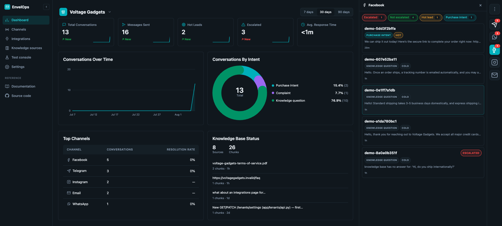

# EnvelOps

AI DM-handling pipeline for small/mid-size businesses — understands intent,
grounds replies in the business's own knowledge, scores the lead, and
either auto-sends or pauses for a human at a hard safety gate. Built as a
demonstration of AI assistant behavior orchestration, safety gating, and
per-tenant configuration. Open source, MIT licensed.



**[Live Demo →](https://envelops.site)**

## Features

- **Multi-channel DM pipeline** — Telegram is a real integration;
  Instagram/WhatsApp/Facebook/Email are simulated (same real pipeline, a
  webhook-shaped entry point, no real platform ever contacted). Every
  inbound message goes through one fixed pipeline: understand intent →
  ground in the business's own knowledge → score the lead → decide the
  next step.
- **Grounded, tenant-scoped knowledge** — a pgvector-backed knowledge
  base per tenant (manual facts, a URL source, a PDF source), retrieved
  by real embedding search, not prompt-stuffing.
- **Real tool-calling for order-status/inventory** — Gemini genuinely
  decides whether a tool call is needed, hitting a bounded fake
  commerce-platform endpoint this same backend also mounts, backed by a
  real per-tenant product catalog.
- **Hard safety gate** — a deterministic regex safety floor
  (contraindication/symptom/outcome-guarantee patterns) plus
  tenant-added trigger phrases pause auto-send and escalate to a human;
  LangGraph-checkpointed, so a paused conversation resumes exactly where
  it left off.
- **Per-tenant behavior config** — typed, bounded configuration
  (business tone, per-channel formality/greeting/sign-off, closing
  action), never free-text AI instructions.
- **Dashboard + Test Console** — a live conversation rail with
  real-time updates, per-message pipeline diagnostics (detected intent,
  lead score, routing decision), and a Test Console to send a message
  through the real pipeline on any channel type without a real
  integration existing yet.
- **Demo mode** — a public, read-only showcase: every mutating endpoint
  is blocked, a lightweight background job keeps the dashboard feeling
  alive (10–15 simulated DMs/day across all 5 channel types, rolling
  7-day retention), and a no-password tenant switch replaces login.

## Tech Stack

FastAPI · Pydantic · SQLAlchemy (async) · PostgreSQL + pgvector ·
LangGraph · Celery · Redis · React · TypeScript · Vite · Google Gemini ·
Docker

## Prerequisites

- Docker and Docker Compose
- A free [Gemini](https://aistudio.google.com/apikey) API key — the
  pipeline's intent understanding, knowledge grounding, lead scoring,
  and tool-calling all run on it for real, not mocked

## Quickstart

```bash
cp .env.example .env   # set ENVELOPS_GEMINI_API_KEY
docker compose up
```

- Backend: http://localhost:8000/healthz
- Frontend: http://localhost:5173
- In-app documentation: http://localhost:5173/docs

## Documentation

- **In-app docs** — once the stack is running, open
  http://localhost:5173/docs for a feature/architecture overview written
  for anyone exploring a running instance
- [`docs/REQUIREMENTS.md`](docs/REQUIREMENTS.md) — what's being built
  and why (fixed, product-level reference)
- [`docs/ARCHITECTURE.md`](docs/ARCHITECTURE.md) — how, for Phase 1
  specifically (tech stack, data model, pipeline steps, API surface)
- [`docs/ROADMAP.md`](docs/ROADMAP.md) — current status, open items, and
  a running changelog; the single place that's kept live session to
  session
- [`CLAUDE.md`](CLAUDE.md) — working conventions for developing this
  repo with Claude Code

## Testing

```bash
cd backend && source .venv/bin/activate && python -m pytest -q
```

400+ backend tests (pytest); `ruff check` / `mypy` for lint and typing.
Frontend: `npm run build` (`tsc -b` + production build) and
`npm run lint` (oxlint) from `frontend/`.

## Contributing

This is primarily a solo portfolio project, but issues and pull requests
are welcome — see [`docs/ROADMAP.md`](docs/ROADMAP.md) for current status
and what's already planned before proposing something large.

## License

MIT — see [LICENSE](LICENSE).
